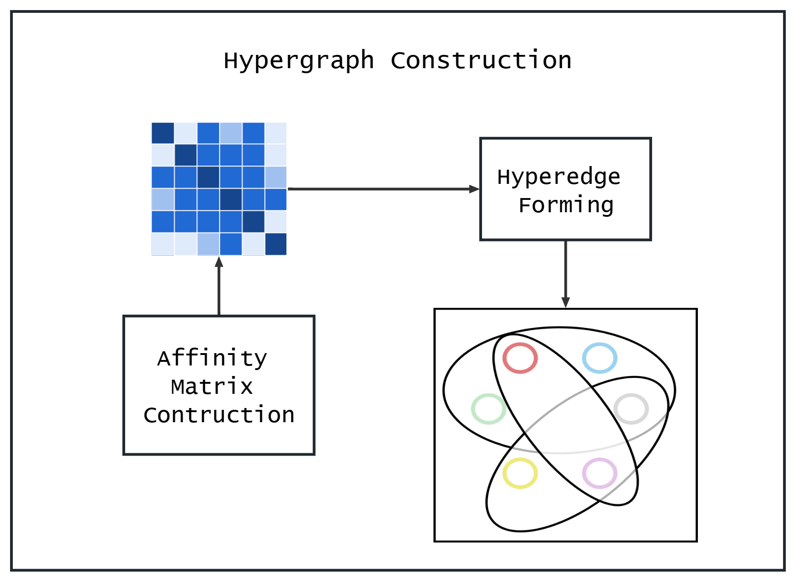
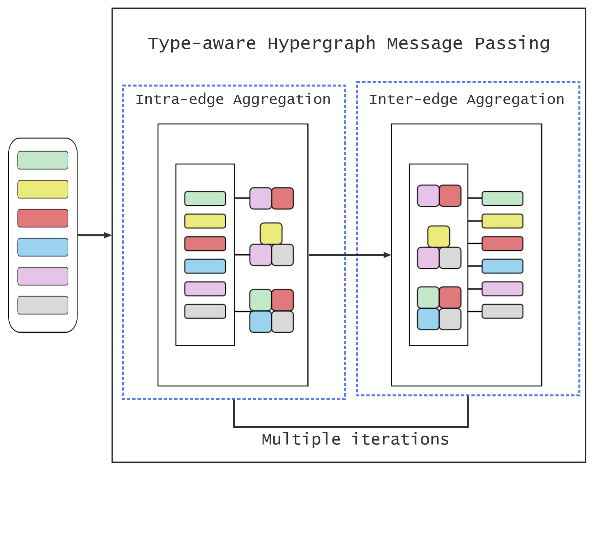

# code sample Hetian Guo
 Part of the implementation for "HHGNN: Heterogeneous Hypergraph Neural Network for Traffic Agents Trajectory Prediction in Grouping Scenarios"

[shortcut]: (./modules.py)

## Hypergraph Construction

## Type-aware Two-level Message passing

## 
